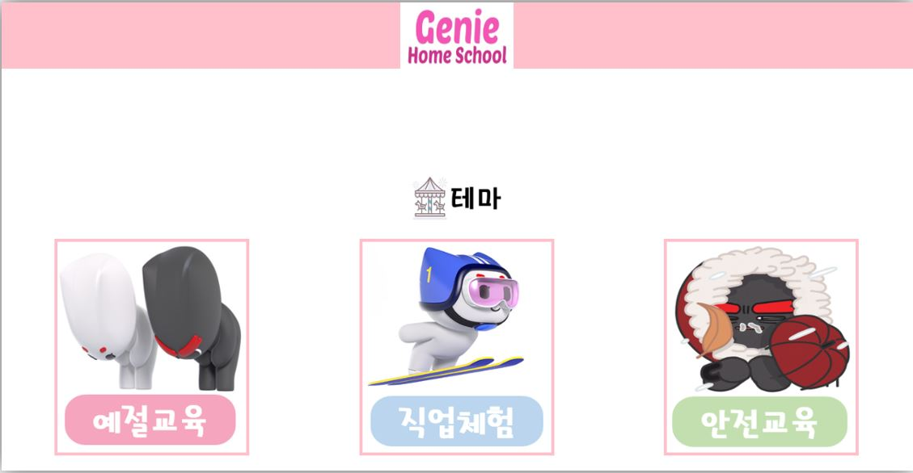

## Genie School - KT 4th Industrial Academy Final Project

### 1. Used: 

- *Giga Genie API(JS)*
  - *TTS, onVoiceFilterMSG*
  - 
- *KT Cloud*
  - *Main Server and rtmp Server(youtube)*
  - 
- *Alpha Pose*
  - *Pose Estimation*
  - 
- *Flask*

### 2. Pages

- Can select Theme with voice. Genie will ask to select a theme.

- After the selection, the example video will be played.
- Then camera will start to record the player's pose and determine whether player performed as required.

### 3. Pose Estimation

### 4. Comment

- This repository is not completed.
- Alpha pose did not applied in the project.
- Flask layouts and structures are built.
